### Toggle Switch Field for Nova 4

For Toggle Switch Field for Nova 3 go to
https://github.com/naifalshaye/toggle-switch

## Features:
 - Set custom color using hex color code
 - Toggle or Icon align. Default (left)
 - Toggle Switch in Index to update value instead of icons. Default (true)

### Requirements
- PHP 8.0 or higher
- Nova 4

## Installation

You can install the package into a Laravel app that uses Nova via composer:

```bash
composer require naif/toggle-switch-field
```

## Usage

Table column migration
```
$table->boolean('toggle')->nullable()->default(true);
```
Add the field to Nova Resource
```
  public function fields(NovaRequest $request)
    {
        return [
           ToggleSwitchField::make('Toggle','toggle')
                ->color('#3AB95A')
                ->toggleAlign('center')
                ->indexToggle(false),
        ];
    }
```

## Screenshots
### Custom hex color code
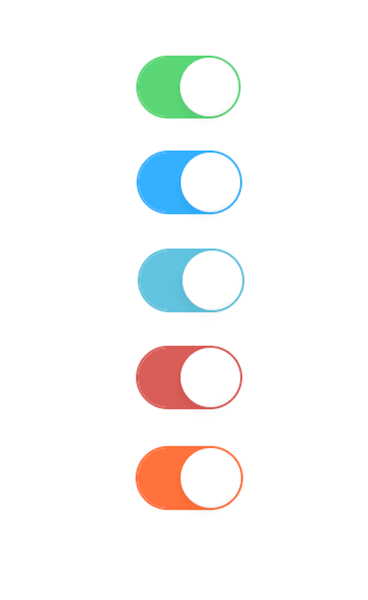<br>

### Edit Page Toggle Switch
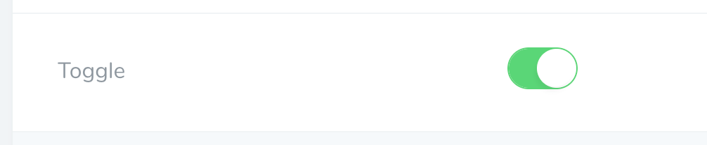<br>
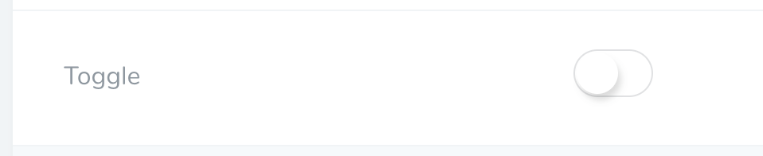<br>
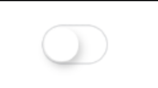<br>
<br>
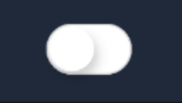<br>
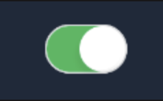<br>

### Index Page Toggle Switch
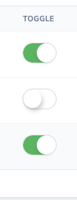<br>
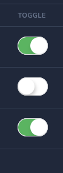<br>

### Index Page icons 
<br>
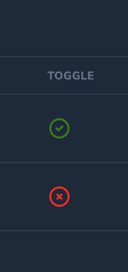<br>

### Detail Page Icons
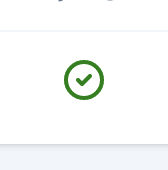<br>
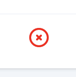<br>
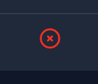<br>
<br>

## Support:
naif@naif.io

https://naif.io

Bug Tracker:

https://github.com/naifalshaye/toggle-switch-field/issues

## License

The MIT License (MIT). Please see [License File](LICENSE.md) for more information.
