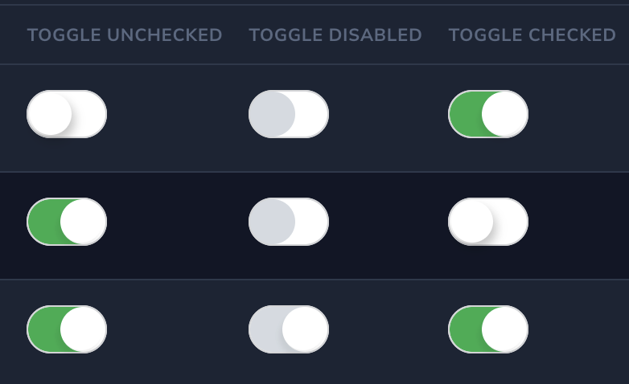
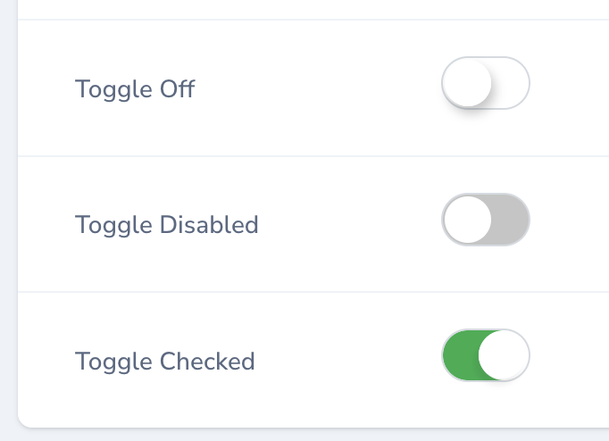

### Toggle Switch Field for Nova 4

For Toggle Switch Field for Nova 3 go to
https://github.com/naifalshaye/toggle-switch

## Features:
 - Set custom color using hex color code.
 - Toggle in Index and details to update value instead of icons. Default (true).
 - Allow multiple toggles in same resource.
 - Allow Disabled toggle (readonly) with Gray color.

### Requirements
- PHP 8.0 or higher
- Nova 4

## Installation

You can install the package into a Laravel app that uses Nova via composer:

```bash
composer require naif/toggle-switch-field
```

## Usage

Table column migration
```
$table->boolean('toggle')->default(true);
```

#### * Add toggle fields to $fillable in Model


Add the field to Nova Resource
```
  public function fields(NovaRequest $request)
    {
        return [
           ToggleSwitchField::make('Toggle','toggle')
                ->color('#3AB95A')
                ->indexToggle(false)
                ->detailToggle(false),
        ];
    }
```

## Screenshots
#### Custom hex color code
<br>
<br>
<br>
<br>
<br>

## Support:
naif@naif.io

https://naif.io

Bug Tracker:

https://github.com/naifalshaye/toggle-switch-field/issues

## License

The MIT License (MIT). Please see [License File](LICENSE.md) for more information.
